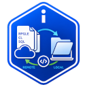

# IBMi Source Member Checkout

<p>
  
</p>

Check out IBM i source members locally, edit them offline, and merge changes back using VS Code's built-in diff editor. Works with [Code for IBM i](https://marketplace.visualstudio.com/items?itemName=HalcyonTechLtd.code-for-ibmi).

## Why?

Editing source members directly through Code for IBM i saves straight to the IBM i on every keystroke-save. This extension lets you **check out a local copy**, work at your own pace, and **merge changes back** when ready — with full diff support and source date preservation.


## Settings
- **Allow Checkout From Protected Filter** - allows you to check out a member from a protect object browser filter
- **Auto Open On Checkout** - automatically open the downloaded source member when checking out
- **Local Folder** - what folder to store the checked out member to. (It's recommended to change this to another folder).
- **Warn On Redownload** - what that the member has already been checked out before overwriting it.

## Features

### Check Out Members

Right-click a member in the Code for IBM i Object Browser and choose **Check Out Member**. The source downloads to a local file (named after the member, e.g. `EXAMPLE.RPGLE`, for correct compilation) organized by system, library, and source file, and shows up in the **Checked Out Members** panel.

Select multiple members (Ctrl/Shift-click) before checking out, and they're all downloaded together — if any are already checked out, you're asked once whether to re-download or skip them.

### Check Out All Members

Right-click a **source file** (one level above members) and choose **Check Out All Members** to pull down every member it contains in one go. Since this can mean a lot of members, a confirmation dialog warns that it may take a while before starting.

### Protected Filter Members

Checkout is hidden by default for members in a protected (read-only) filter. Enable `ibmi-checkout.allowCheckoutFromProtectedFilter` to allow it when you deliberately want a local working copy of a protected source.

### Merge Back to IBM i

Right-click a checkout and choose **Merge Back to IBM i** to open a diff view — your local changes on the left, the live remote member on the right. Use VS Code's merge arrows to selectively apply changes, then save the remote side; Code for IBM i handles the upload and **preserves source dates**.

### Upload to IBM i

For a quick full replace, use **Upload to IBM i**. This overwrites the remote member with your local copy. A warning confirms that **source dates will not be preserved**.

### Refresh Remote Status

Compares your local file, the live remote content, and the remote content as it was at checkout time (not just a stale comparison) to classify each checkout:

- **In sync** — local matches remote exactly
- **Modified** — you've edited locally; remote is unchanged (safe — nothing to lose)
- **Conflict** — remote changed *and* still differs from local (re-checkout would discard your edits — review with Merge Back first)

Refresh per member (inline icon or context menu, with a conflict prompt to Merge Back or Re-checkout), per source file group, or for every checkout at once from the panel toolbar.

### Compare With

Right-click a checkout for comparison tools: **Select for Compare** (mark one checkout, then **Compare with Selected** on another), **Compare with Active File**, **Compare with Local File**, **Compare with IFS File**, or **Compare with Member** (any source member by path).

### Other Actions

- **Open Local File** / **Open Remote File** — open either copy in the editor
- **Run Action** — trigger Code for IBM i's local source actions (compile, deploy, etc.)
- **Reveal in File Explorer** — show the local file in your OS file manager
- **Copy Member Path** — copy `LIBRARY/SOURCEFILE(MEMBER)` to the clipboard
- **Discard Checkout** — delete the local file and stop tracking it (with confirmation)

### Multi-Select

The Checked Out Members panel supports selecting multiple checkouts at once. **Open Local/Remote File, Run Action, Upload to IBM i, Refresh Remote Status,** and **Discard Checkout** all work on a multi-selection, each confirming with a message naming how many members the action will affect before proceeding. Actions that only make sense for one item at a time (Merge Back, Compare With, Copy Member Path, Reveal in File Explorer) are single-selection only.

## Settings

| Setting | Default | Description |
|---------|---------|-------------|
| `ibmi-checkout.localFolder` | *(empty)* | Custom folder for checked-out files. Leave empty to use extension storage. |
| `ibmi-checkout.warnOnRedownload` | `true` | Show warning when checking out a member that is already checked out. |
| `ibmi-checkout.autoOpenOnCheckout` | `true` | Automatically open the file in the editor after a single-member checkout. |
| `ibmi-checkout.allowCheckoutFromProtectedFilter` | `false` | Allow checking out members from protected (read-only) filters. |

## Local File Structure

```
checkouts/
  myhost.company.com/
    MYLIB/
      QRPGLESRC/
        PAYROLL.RPGLE
      QCLSRC/
        PAYROLLC.CLLE
```

Organizing by system, library, and source file preserves the original filename for compilation and prevents collisions across different IBM i systems.

## Requirements

- [Code for IBM i](https://marketplace.visualstudio.com/items?itemName=HalcyonTechLtd.code-for-ibmi) v3.0.0 or later
- Active connection to an IBM i system

## License

GPL-3.0
